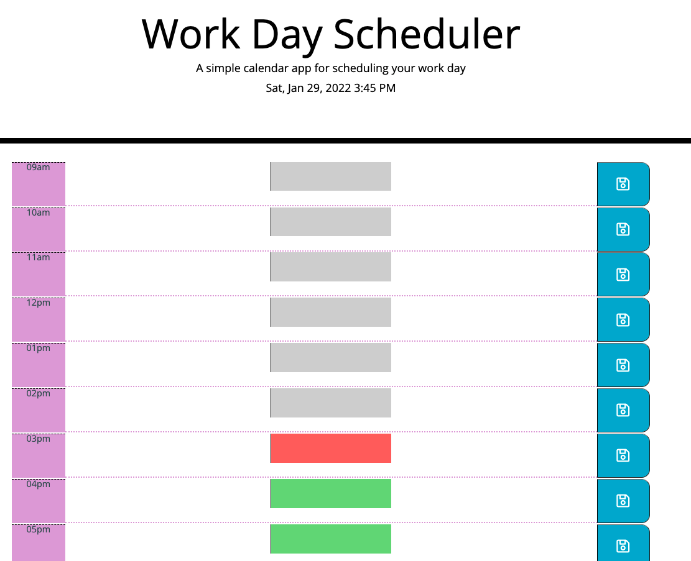

# Work Day Scheduler
> If you are not willing to learn, no one can help you. If you are determined to learn, no one can stop you. -Zig Ziglar

---
## Description
- I have created a calendar applicaion that allows users to save important events for each hour of the day.

---
## Used
- HTML
- CSS
- Bootstrap CSS Framework
- jQuery API
- JavaScript

---

## **Link** and **Preview** of Deployed Web Page

- [Deployed Web Page](https://caitlyn-griffing.github.io/work-day-scheduler/)

---

## Important Links

- [Deployed URL](https://caitlyn-griffing.github.io/work-day-scheduler/)
- [GitHub Repo](https://github.com/caitlyn-griffing/work-day-scheduler)

---

## Licensing

- [MIT](https://github.com/caitlyn-griffing/work-day-scheduler/blob/main/LICENSE)

---

## Contact Information

Caitlyn Griffing

- 469-278-6558

- griffingcaitlyn@gmail.com

[Click to Schedule a *Call With Me!*](https://calendly.com/caitlyngriffing/15min)
